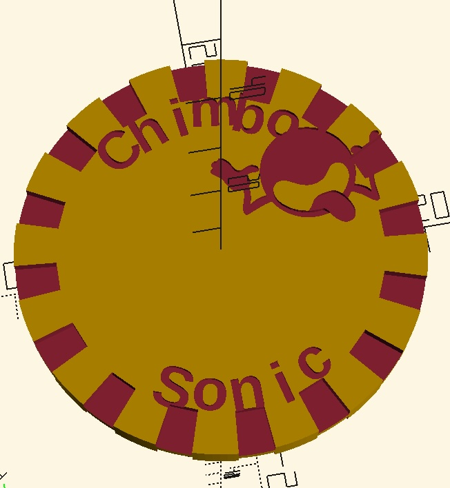

# maker-chip

Parametric OpenSCAD design for a casino-style poker chip with embossed edge
spots, logo, text, and a QR code — ready for FDM printing.

## Features

- 39 mm casino-standard disc, 3.5 mm thick (parametric)
- Embossed edge spots, SVG logo, custom text, and a QR code
- QR generated natively in OpenSCAD via [scadqr](https://github.com/xypwn/scadqr)
- All features rise to the same emboss height for clean multi-material prints
- Exports to 3MF / AMF preserve per-feature colors

## Files

| File | Purpose |
| --- | --- |
| `maker-chip.scad` | Main model. Open in OpenSCAD. |
| `qr.scad` | scadqr dependency, included by the main file. |
| `logo.svg` / `logo.dxf` | Source artwork for the embossed logo. |
| `Orbitron-VariableFont_wght.ttf` | Font used for the text on the front face. |
| `maker-chip.3mf` | Pre-rendered multi-material export. |

## Usage

1. Install [OpenSCAD](https://openscad.org/) (2021.01 or newer).
2. Install the `Orbitron` font, or change `text_font` in the `.scad` file.
3. Open `maker-chip.scad` and tweak the parameters at the top:
   - `qr_text` — what the QR encodes (set to `""` to disable)
   - `text_top` / `text_bottom` — front-face text
   - `logo_file` — swap in your own SVG (closed paths work best)
   - `disc_color` / `spot_color` / `logo_color` / `text_color` / `qr_color`
4. Render (F6) and export to 3MF for a multi-material slicer, or STL for
   single-color printing.

## Print orientation

Print **face up**. Bottom-face features sit on the bed (use a brim if
adhesion is borderline); the disc bridges the small gaps between bottom
spots; top-face features print last with the cleanest detail.

The QR code is X-mirrored by default (`qr_mirror_x = true`) so it scans
correctly after flipping the chip over its Y axis — the natural "page
flip" motion.

## License

MIT — see [LICENSE](LICENSE).
